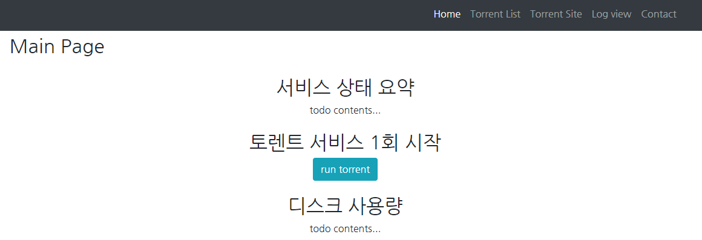
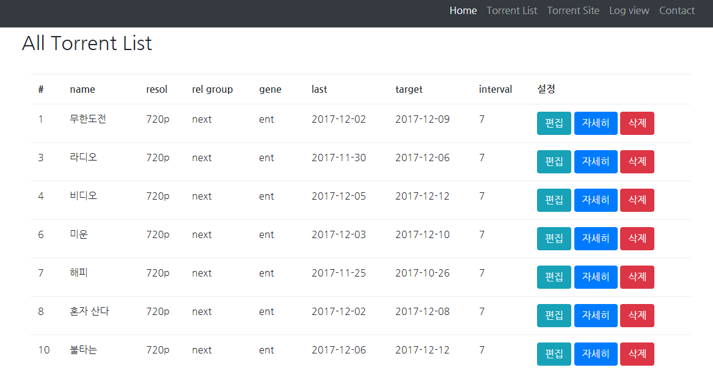
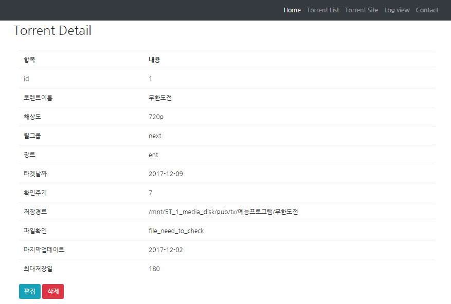
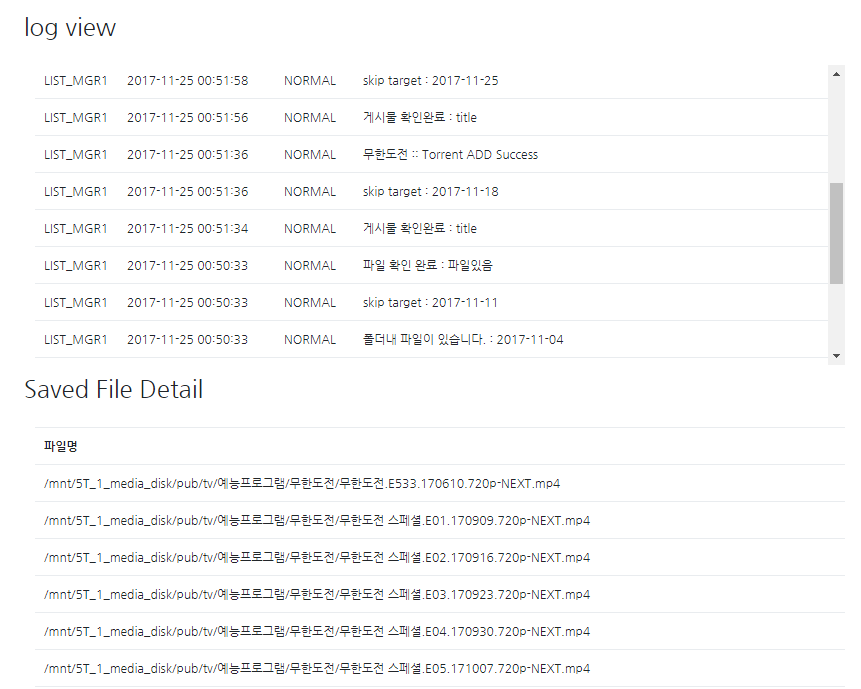
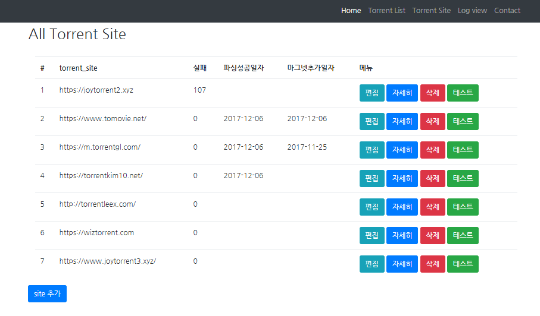

## TOC
- [프로그램설명](#프로그램설명)
- [설치준비 (필수 패키지 설치)](#설치준비-필수-패키지-설치)
  - [기타패키지 설치](#기타패키지-설치)
  - [python 패키지 설치](#python-패키지-설치)
  - [db 설치](#db-설치)
  - [transmission-deamon 설치](#transmission-deamon-설치)
- [프로그램 설치하기](#프로그램-설치하기)
  - [환경변수 세팅](#환경변수-세팅)
- [실행](#실행)
- [동작관련](#동작관련)
- [실행화면예시](#실행화면예시)


너무 간단한 프로그램이지만... 아는 사람들만 ㅋㅋㅋ

> 초기 동작을 위한 인스톨? 을 하려면 패스워드가 필요함 아는사람만 프로젝트 참가가능?

* 오드로이드에서 동작확인!!
## 프로그램설명

각 폴더별로 설명

- [kks_modules](./kks_modules)

  - 실제 동작에 필요한 python 스크립트 모음
  - db로 연동하여 동작
  - 하기 폴더에 있는 스크립트들은 django 와 관련없이 동작한다.

- [django_site](./django_site)
  - django site 관련내용들
  - django 에서는 kks_modules 의 각 모듈들을 불러서 동작한다.
  - django 는 단순히 torrent list 를 위한 관리측면?

- [settings](./settings)
  - 동작에 필요한 파일들
  - 설치파일 / sql 예제들 / site 파싱용 파일들
   - 설치시 passwd 필요?

- [tools](./tools)
  - 유용한 스크립트들 ㅋㅋ
  
## 설치준비 (필수 패키지 설치)

필요한 사항을 정리한다.

### 기타패키지 설치

간혹 python 패키지 설치할때 빌드 관련 에러가 나기때문에 해당 내용을 먼저설치한다.

```
sudo apt-get install build-essential libssl-dev libffi-dev python-dev python3-dev
```

### python 패키지 설치

파이썬 2.7 / 3.x 모두 사용가능 로 모두 구현.

```bash
sudo apt-get install python-pip
# python modules 
sudo pip install bs4 mechanize bencode selenium wget progress pymysql
# django install
sudo pip install django djangorestframework
```

### db 설치
mysql  / mariadb 둘중 한개 설치
* root 권한으로 import 할수있도록 준비한다.

### transmission-deamon 설치
transmission-deamon 패키지를 설치한다.

## 프로그램 설치하기
clone 후에 다음의 파일을 실행한다.
```
settings/install/server_install.sh
```

 * 압축이 풀리면서 db를 import 한다.
 * 압축이 풀리면서 실행파일이 나오는데 그것을 실행한다.

### 환경변수 세팅
`settings/user.config.env` 를 각 환경에 맞게 세팅한다.
 * 동작 폴더 / mysql / transmission-deamon 등에 대한 환경을 설정

## 실행
`settings/run.server.sh` 를 실행하면 웹서버가 실행되면서 동작
 * 환경변수 파일을 세팅하면 굳이 웹서버나 python 스크립트를 고칠필요없다 ㅋ


## 동작관련
 * `settings/run.server.sh` 에서 loop 돌면서 크롤링한다.
 * 만약 해당 부분이 싫다면 직접 cron 에서 실행시키면된다.

## 실행화면예시











